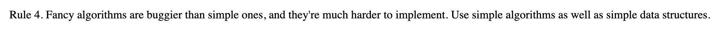

## Where to get the material


## What is DS?

Data **Science** is the practice of using data to try to understand and solve real-world problems.

Coined in 2008 as technologies evolved and data became bigger.<sup>\*</sup>

A _broad_ field. People get into it from all backgrounds and there is an abundance of resources available to get you started or advance.

Data is **everywhere**. Data scientists will always be in demand.

<sup>\*Build a Career in Data Science, 2019</sup>


## How the Untrained Do Science

The workflow:

- Collect data in Excel
- Do summary statistics
- Use the import menu to import into an analysis package
- Do analysis with menus
- Fix problems in Excel
- Use the import menu again
- Point and click to more and more analyses
- Copy and paste numbers into Word
- Copy and paste into PowerPoint

_This is antithetical to reproducible research_


## Why R?

Elegant functional programming language that dominates health research

Base R:

- `c()`
- `df[]`
- `<-`
- `order()`
- `which()`


## Base R vs. Tidyverse

#### What is the Tidyverse? 
 
"At a high level, the tidyverse is a language for solving data science challenges with R code. Its primary goal is to facilitate a conversation between a human and a computer about data. Less abstractly, the tidyverse is a collection of R packages that share a high-level design philosophy and low-level grammar and data structures, so that learning one package makes it easier to learn the next."


## Pros:

- designed for functional programming?
  - Functional Programming is an approach to replace iterative (i.e. for) loops. `purrr` package
- consistent functions
- workflow coverage
- a path to data science education
- a parsimonious approach to the development of data science tools
- and the possibility of greater productivity


## DS With The Verse


(Rickert, 2017)


## The Pipe


## Tidyverse `{dplyr}`

[**Design for humans!!**](https://design.tidyverse.org/unifying-principles.html#human-centered) 	&#x1F98A;

Main dplyr verbs:

- `filter`
- `arrange`
- `select`
- `mutate`
- `summarise`

*Code Time!* &#x1F57A;


## The Unix Philosophy



Basically...

- Write simple parts
- Being clear is better than being clever
- Design programs to be connected to other programs (modularity)
- When you must fail, fail noisily  
 


## The Unix Philosophy (cont..)

- `Tidyverse` Specific:

  - File names should be meaningful and end in `.R`. Avoid using special characters in file names
  - If files should be run in a particular order, prefix them with numbers.
  - Use commented lines of `-` and `=` to break up your file into easily readable chunks.
  - Variable and function names should use only lowercase letters, numbers, and `_`.
    - snake_case
  - Generally, variable names = nouns, function names = verbs


## Tidyverse Style

An example:

```r[1|2|3|4]
# Name Vars -------------------------
  my_var
  var_1
  make_names()
```


## Typical DS Pipeline


<small>Wickham et al, 2018</small>


## Plotting (cake first)

&#x1F4E6; : `ggplot2` &#x1F4CA;  
&#x1F4D6; : https://ggplot2.tidyverse.org/

- Based on [Grammer of Graphics](https://amzn.to/2ef1eWp)
- Components of the ggplot are combined with the `+` operator


## Plotting (cake first, cont..)

Some Terminology:  

- _Geoms_ are the geometric objects that are drawn to represent the data, such as bars, lines, and points
- Aesthetic attributes, or _aesthetics_, are visual properties of geoms, such as x and y position, line color, point shapes, etc
- There are *mappings* from data values to aesthetics
- _Scales_ control the mapping from the values in the data space to values in the aesthetic space. A continuous y scale maps larger numerical values to vertically higher positions in space

<small>R Graphics Cookbook, 2018</small>


## 1. Import Data

Take data stored in a file, database, or web application programming interface (API), and load it into a data frame in R.  
**Some useful packages:**  
&#x1F4E6; : `readr`  
&#x1F4D6; : https://readr.tidyverse.org/  
&#x1F680; : Rectangular data (.csv, .tsv, etc)

&#x1F4E6; : `readxl`  
&#x1F4D6; : https://readxl.tidyverse.org/  
&#x1F680; Excel files (.xls, .xlsx, etc)

&#x1F4E6; : `haven`  
&#x1F4D6; : https://haven.tidyverse.org/  
&#x1F680; Files from other statistical software (SAS, SPSS, STATA etc)


## 1.1 Our Data 

##### *Hypothesis*

Places within Miami-Dade County with higher income have lower percentages of food stamp recipients
##### _Our Data_

ACS Supplemental Nutrition Assistance Program (SNAP) benefits 2019 5-year estimates
##### *Source*

[American Community Survey (ACS) data from the U.S. Census Bureau](data.census.gov)  - TableID: S2201

##### *Geography*

Census tracts in Miami-Dade County


## 1.2 `{tidycensus}`

What is[ `{tidycensus}`](https://walker-data.com/tidycensus/index.html)?   
> an R package that allows users to interface with the US Census Bureau's decennial Census and five-year American Community *APIs* and return tidyverse-ready data frame.

 **A**pplication **P**rogram **I**nterface  

allows a user to programatically pull data from a source given that source provides one  
*ex. The NYT, Twitter, Facebook, Google, US Census*


#### 1.2.1 How Do APIs Work? 

Think of it like this, just like a Graphical User Interface (GUI) allows you to interact with your code, an API lets your code interact with other code 

  

<medium> DO NOT SHARE/PUBLISH YOUR API KEY!! </medium>


## 2. Tidy

Tidy data:

1. Each variable forms a column.
2. Each observation forms a row.
3. Each value must have its own cell.


## 3. Transform/EDA

What is EDA?

**E**xploratory **D**ata **A**nalysis!

- Iterative cycle to develop questions about your data
- State of mind
- One of the most important steps of an anlysis

Scroll down for some terminology and common types of plots for EDA :D


## 3.1 Terminology

- *Variable* = quantity, quality, or property that you can measure
- *Value* = state of a variable when you measure it
- *Observation* = set of measurements made under similar conditions
- *Variaton* = describes the behavior within a variable
- *Covariation* = the tendency for the values of two or more variables to vary together in a related way


## 3.2 Histograms
"A histogram divides the x-axis into equally spaced bins and then uses the height of a bar to display the number of observations that fall in each bin"

Great for examining the distribution of a continuous variable
```r
ggplot(diamonds) %>%
  geom_histogram(mapping = aes(x = carat), binwidth = 0.5)
```
  

<small>R For Data Science, 2018</small>


## 3.3 Box Plots


<small>R For Data Science, 2018</small>


## 3.4 Correlation Matrix

*What is correlation?* 

- The correlation metric tells us how much one variable changes with a slight change in another variable.
- A high correlation value between a dependent variable and an independent variable indicates that the independent variable is of very high significance in determining the output


## 4. Analysis/Model

Some useful terminology:  

- *log transform* : replace each variable `x` with a `log(x)`. Doing so usually helps skewed data become less skewed. It can also help make patterns more visible
- *linear regression* : finding the best-fitting straight line through the points. The best-fitting line is called a *regression line.*
  
```r
lm(dependantVar ~ independentVar, data = df)
```
- *p-value*: evidence against a null hypothesis. The smaller the p-value, the stronger the evidence that you should reject the null hypothesis.


## 5. Communicate


## Resources

[R For Data Science](https://r4ds.had.co.nz/) : comprehensive guide to doing data science with R  
[Tidyverse Style Guide](https://style.tidyverse.org/) : how to make sure your code is elegant and redeable for optimal reproducibility  
[RStudio Cheetsheets](https://rstudio.com/resources/cheatsheets/) : who doesn't love a cheatsheet?  
[Unix Design Principle](https://homepage.cs.uri.edu/~thenry/resources/unix_art/ch01s06.html) : general programming best practices  
[R Graphics Cookbook](https://r-graphics.org/) : Up your `ggplot2` game with recipes for several types of plots
