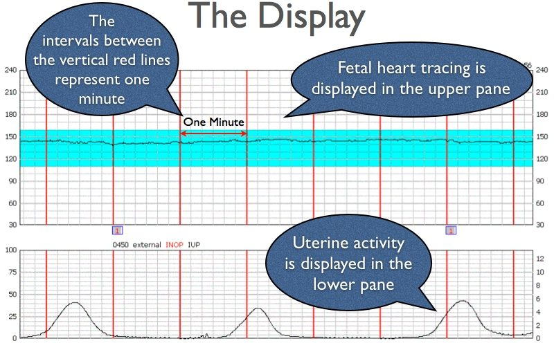

## Data Information

Name: fetal_health.csv  
NumCols: 22  
NumRecords: 2,126  
Source: https://www.kaggle.com/andrewmvd/fetal-health-classification  
Resource to Understand how to read CTGs: https://www.stepwards.com/?page_id=3587

### Variables

- 'baseline value'- FHR baseline (beats per minute)
- 'accelerations'- Number of accelerations per second
- 'fetal_movement'- Number of fetal movements per second
- 'uterine_contractions'- Number of uterine contractions per second
- 'light_decelerations'- Number of light decelerations per second
- 'severe_decelerations'- Number of severe decelerations per second
- 'prolongued_decelerations'- Number of prolonged decelerations per second
- 'abnormal_short_term_variability'- Percentage of time with abnormal short term variability
- 'mean_value_of_short_term_variability'- Mean value of short term - variability
- 'percentage_of_time_with_abnormal_long_term_variability'- Percentage of time with abnormal long term variability
- 'mean_value_of_long_term_variability'- Mean value of long term variability
- 'histogram_width'- Width of FHR histogram
- 'histogram_min'- Minimum (low frequency) of FHR histogram
- 'histogram_max'- Maximum (high frequency) of FHR histogram
- 'histogram_number_of_peaks'- Number of histogram peaks
- 'histogram_number_of_zeroes'- Number of histogram zeros
- 'histogram_mode'- Histogram mode
- 'histogram_mean'- Histogram mean
- 'histogram_median'- Histogram median
- 'histogram_variance'- Histogram variance
- 'histogram_tendency'- Histogram tendency
- 'fetal_health' Tagged as 1 (Normal), 2 (Suspect) and 3 (Pathological)
