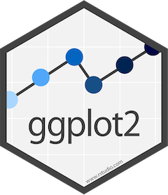

## Where to get the material


## What is DS?

Data **Science** is the practice of using data to try to understand and solve real-world problems.

Coined in 2008 as technologies evolved and data became bigger.<sup>\*</sup>

A _broad_ field. People get into it from all backgrounds and there is an abundance of resources available to get you started or advance.

Data is **everywhere**. Data scientists will always be in demand.

<sup>\*Build a Career in Data Science, 2019</sup>


## How the Untrained Do Science

The workflow:

- Collect data in Excel
- Do summary statistics
- Use the import menu to import into an analysis package
- Do analysis with menus
- Fix problems in Excel
- Use the import menu again
- Point and click to more and more analyses
- Copy and paste numbers into Word
- Copy and paste into PowerPoint

_This is antithetical to reproducible research_


## Why R?

Elegant functional programming language that dominates health research

Base R:

- `c()`
- `df[]`
- `<-`
- `order()`
- `which()`


## Base R vs. Tidyverse

#### What is the Tidyverse? 
 
"At a high level, the tidyverse is a language for solving data science challenges with R code. Its primary goal is to facilitate a conversation between a human and a computer about data. Less abstractly, the tidyverse is a collection of R packages that share a high-level design philosophy and low-level grammar and data structures, so that learning one package makes it easier to learn the next."


## Pros:

- designed for functional programming?
  - Functional Programming is an approach to replace iterative (i.e. for) loops. `purrr` package
- consistent functions
- workflow coverage
- a path to data science education
- a parsimonious approach to the development of data science tools
- and the possibility of greater productivity


## DS With The Verse


(Rickert, 2017)


## The Pipe


## Tidyverse `{dplyr}`

**Design for humans!!** :D  
Main dplyr verbs:

- `filter`
- `arrange`
- `select`
- `mutate`
- `summarise`


## The Unix Philosophy


Basically...

- Write simple parts
- Being clear is better than being clever
- Design programs to be connected to other programs (modularity)
- When you must fail, fail noisily  
 


## The Unix Philosophy (cont..)

- `Tidyverse` Specific:

  - File names should be meaningful and end in `.R`. Avoid using special characters in file names
  - If files should be run in a particular order, prefix them with numbers.
  - Use commented lines of `-` and `=` to break up your file into easily readable chunks.
  - Variable and function names should use only lowercase letters, numbers, and `_`.
    - snake_case
  - Generally, variable names = nouns, function names = verbs


## The Unix Philosophy (cont..)

An example:

```r
# Name Vars -------------------------
  my_var
  var_1
  make_names()
```


## Typical DS Pipeline


<small>Wickham et al, 2018</small>


## Plotting (cake first)

📦: `ggplot2` :bar_chart:   
📖: https://ggplot2.tidyverse.org/

- Based on [Grammer of Graphics](https://amzn.to/2ef1eWp)
- Components of the ggplot are combined with the `+` operator



<small>R Graphics Cookbook, 2018</small>


## Plotting (cake first, cont..)

Some Terminology:  

- _Geoms_ are the geometric objects that are drawn to represent the data, such as bars, lines, and points
- Aesthetic attributes, or _aesthetics_, are visual properties of geoms, such as x and y position, line color, point shapes, etc
- There are *mappings* from data values to aesthetics
- _Scales_ control the mapping from the values in the data space to values in the aesthetic space. A continuous y scale maps larger numerical values to vertically higher positions in space


## 1. Import Data

Take data stored in a file, database, or web application programming interface (API), and load it into a data frame in R.  
**Some useful packages:**  
📦: `readr`  
📖: https://readr.tidyverse.org/  
🔮: Rectangular data (.csv, .tsv, etc)

📦: `readxl`  
📖: https://readxl.tidyverse.org/  
🔮: Excel files (.xls, .xlsx, etc)

📦: `haven`  
📖: https://haven.tidyverse.org/  
🔮: Files from other statistical software (SAS, SPSS, STATA etc)


## 1. Import Data (cont..)

##### _Our Data_

Fetal Health Cardiotocograms (CTGs) records.

##### _Background_

Reduction of child mortality is a key indicator of human progress. The UN expects that by 2030, countries will reduce 'under 5' mortality to at least as low as 25 per 1,000 live births. Maternal mortality accounts for about 295k deaths as of 2017, 95% of which are preventable. Cardiotocograms (CTGs) are a simple and cost accessible option to assess fetal health, allowing healthcare professionals to take action in order to prevent child and maternal mortality.

<small>Ayres de Campos et al. (2000) SisPorto 2.0 A Program for Automated Analysis of Cardiotocograms. J Matern Fetal Med 5:311-318</small>


## 2. Tidy

Tidy data:

1. Each variable forms a column.
2. Each observation forms a row.
3. Each value must have its own cell.


## EDA

What is EDA?

**E**xploratory **D**ata **A**nalysis!

- Iterative cycle to develop questions about your data
- State of mind
- One of the most important steps of an anlysis


## Analysis


## Communication


## Resources

[R For Data Science](https://r4ds.had.co.nz/) : comprehensive guide to doing data science with R  
[Tidyverse Style Guide](https://style.tidyverse.org/) : how to make sure your code is elegant and redeable for optimal reproducibility  
[RStudio Cheetsheets](https://rstudio.com/resources/cheatsheets/) : who doesn't love a cheatsheet?  
[Unix Design Principle](https://homepage.cs.uri.edu/~thenry/resources/unix_art/ch01s06.html) : general programming best practices  
[R Graphics Cookbook](https://r-graphics.org/) : Up your `ggplot2` game with recipes for several types of plots
